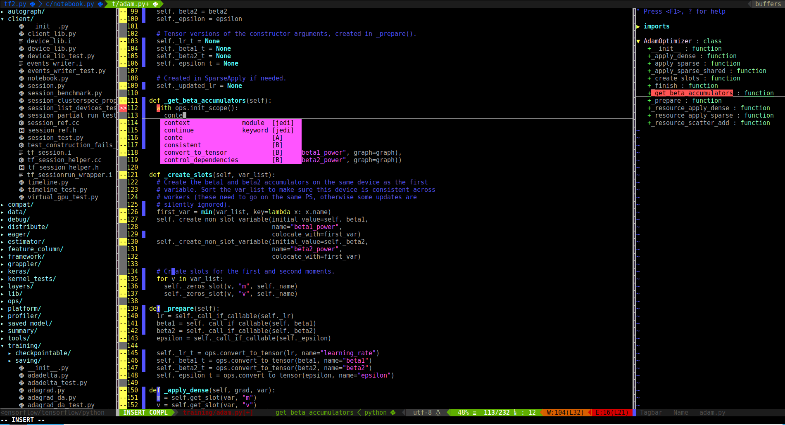

# Vim as IDE 

This guide will cover the steps to configure the Vim to be used as an IDE (In case i loose my configuration again... 😭 ). At the time of this writing, the configuration reflects a strong flavor towards Python and it was done in Ubuntu 18.04, but it should be easy to use other languages in other OS.



## Vim Plugins
* **[Plugin manager](#plugin-manager):** [Vundle](https://github.com/VundleVim/Vundle.vim)
* **File system explorer:** [NERDTree](https://github.com/scrooloose/nerdtree)
* **Tag browser:** [Tagbar](https://github.com/majutsushi/tagbar)
* **[Asynchronous completion](#asynchronous-completion):** [Deoplete](https://github.com/Shougo/deoplete.nvim)
* **Python modules completion:** [Deoplete-Jedi](https://github.com/zchee/deoplete-jedi)
* **[Asynchronous syntax checking](#asynchronous-syntax-checking):** [ALE](https://github.com/w0rp/ale)
* **[Status bar](#status-bar):** [Vim-Airline](https://github.com/vim-airline/vim-airline)
* **Status bar themes:** [Vim-Airline-Thimes](https://github.com/vim-airline/vim-airline-themes)
* **[Beatiful icons](#beatiful-icons):** [Vim-Devicons](https://github.com/ryanoasis/vim-devicons)

## Vim configuration
* **General configurations**
* **[System clipboard accessing](#system-clipboard-accessing)**
* **Custom shortcuts**

### Plugin Manager

Source: [Vundle](https://github.com/VundleVim/Vundle.vim)

Set up Vundle:
```
git clone https://github.com/VundleVim/Vundle.vim.git ~/.vim/bundle/Vundle.vim
```
Put the .vimrc provided in this repository in your `home` directory: `/home/$USER`. 

To install ALL Plugins listed below:
Launch vim and run `:PluginInstall`

### Asynchronous Completion

Install the Python package neovim:
```
$ sudo pip install neovim
```

### Asynchronous Syntax Checking

There is a bug with the Vim current version (2:8.0.1453-1ubuntu1) of the Ubuntu 18.04, when using ALE. The cursor is hidden when it passes over lines with warnings or errors.This bug has been fixed in the version 2.8.0-1476-1.  
To upgrade the Vim in Ubuntu, you have to install it through a PPA:
```
$ sudo add-apt-repository ppa:jonathonf/vim
$ sudo apt update
$ sudo apt install vim
```

### Status Bar

To use the full potential of Vim-Airline, you should install the Powerline Font package on your system:
```
$ sudo apt install fonts-powerline
```

### Beatiful icons

To use the Vim-Devicons plugin, you must have a NerdFont compatible font.  

Install the font-manager:
```
$ sudo apt-get install font-manager
```
Set your system's terminal font by running:
```
$ sudo dpkg-reconfigure console-setup
```

Check the patched font equivalent to your chosen font of the terminal:
[Patched Fonts](https://github.com/ryanoasis/nerd-fonts#patched-fonts)

Download the correspondent font:
[NerdFont Releases](https://github.com/ryanoasis/nerd-fonts/releases)

Unzip the font file and use the font-manager to install the files

### System Clipboard Accessing

To access the system clipboard, you must have Vim with +X11 enabled. The easier way to get it is by installing:
```
$ sudo apt-get install vim-gui-common
```
Now you can copy/paste to/from system clipboard with `"+y`/`"+p`
